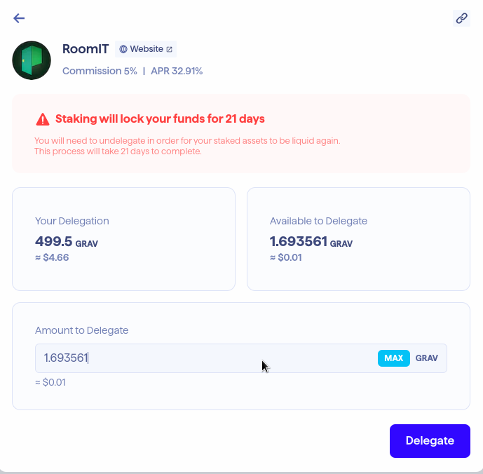
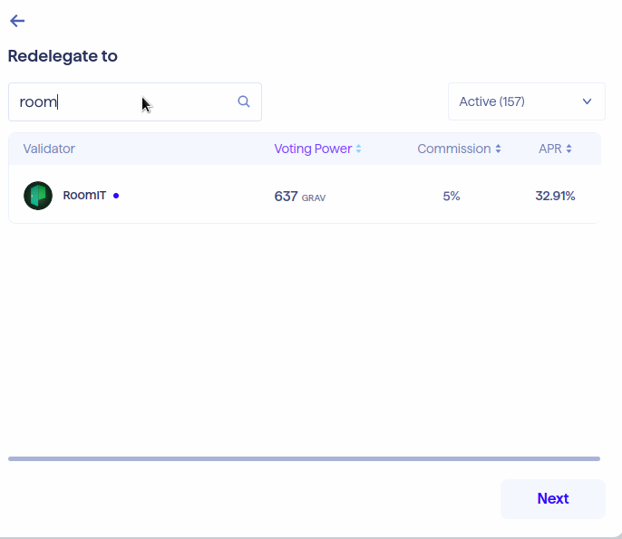

# How to Stake Your Token

Access [Web Keplr Wallet RoomIT](https://wallet.keplr.app/chains/gravity-bridge?modal=validator\&chain=gravity-bridge-3\&validator\_address=gravityvaloper1ssduj8c0cc8kquljvw3ygq9hduvcysnf590lmz\&referral=true)

Click Delegate if you did not stake yet in other validator .

<figure><figcaption>
Delegate $GRAV
</figcaption></figure>

If you have done delegate in other validator and intersting join us. Just click redelagate and search RoomIT, Next and Delegate your amount.

<figure><figcaption>
Redelegate to RoomIT Validator
</figcaption></figure>

