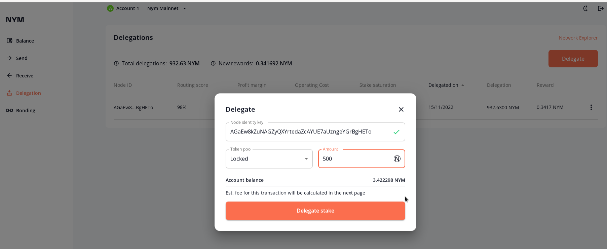

# How to Stake Your Token

Download Wallet :

[https://nymtech.net/download-nym-wallet/](https://nymtech.net/download-nym-wallet/)\
\
Import your seed key. We assume, you have $NYM Token.


Copy Our ID Node Mixnode :&#x20;

```bash
AGaEw8kZuNAGZyQXYrtedaZcAYUE7aUzngeYGrBgHETo
```


1. Open NYM Wallet
2. Move to menu **Delegation** and Click Delegate Button on Right Top.&#x20;

<figure><figcaption><p>Delegate</p></figcaption></figure>

3\. Click Delgate Stake and Delegate.


