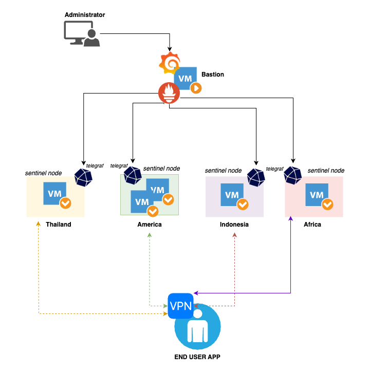
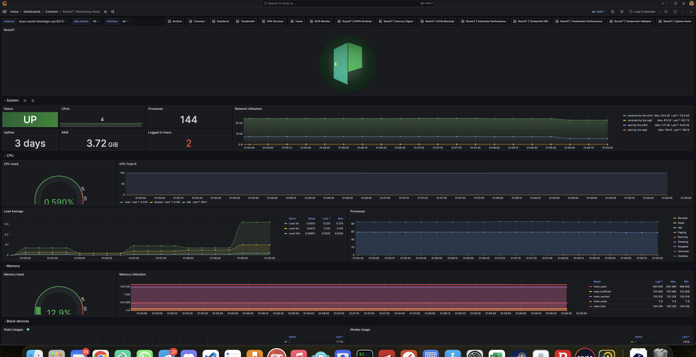

# APM Sentinel Node

### Architecture

<figure><figcaption></figcaption></figure>

### Tech Stack

We used Grafana, Prometheus and Telegraf, where grafana for visualization, prometheus as database collector data and telegraf as metrics agent.

### Installations Platform

#### Install Grafana and Prometheus

you can refer the pages [Install Monitoring Stack](../../../monitoring/install-monitoring-stack.md). Please deploy Grafana and promethus in your bastion or other server (non sentinel node). Esspecially VPS for Monitoring Only, In case above Architecture we should install in bastion VM.

Configuration Prometheus, you can add in /etc/prometheus/prometheus.yml

```
### TELEGRAF SYSTEM OS
  - job_name: "Hosts"
    metrics_path: '/metrics'
    static_configs:
      - targets:
        - "10.66.67.50:9273"
        - "10.66.67.51:9273"
        - "10.66.67.52:9273"
        - "10.66.67.53:9273"
        - "10.66.67.54:9273"
    relabel_configs:
      - source_labels: [__address__]
        regex: '10.66.67.50:9273'
        target_label: 'instance'
        replacement: 'dvpn.roomit-biznetgio.xyz:9273'
      - source_labels: [__address__]
        regex: '10.66.67.51:9273'
        target_label: 'instance'
        replacement: 'dvpn.roomit-ikuola.xyz:9273'
      - source_labels: [__address__]
        regex: '10.66.67.52:9273'
        target_label: 'instance'
        replacement: 'dvpn.roomit-hostodo.xyz:9273'
      - source_labels: [__address__]
        regex: '10.66.67.53:9273'
        target_label: 'instance'
        replacement: 'dvpn.roomit-oneprovide.xyz:9273'
      - source_labels: [__address__]
        regex: '10.66.67.54:9273'
        target_label: 'instance'
        replacement: 'dvpn.roomit-pqhost.xyz:9273'
```

we assume you have connected from bastion to each sentinel node with netwrok private. you can used vswitch or vpn.

```
10.66.67.0/24 # Segment IP Sentinel Node
10.66.67.x # Will be relabeling with the name of instance, so make sure you have naming with your condition
/metrics # is end point for collect the metrics
```

#### Install Telegraf

We used telegraf as metrics collector .  automation installation metrics collector please find below. Create file in your sentinel node, we assume the file name _**sentinel-telegraf.sh**_

> we assume your API Sentinel Node EndPoint used 7777, if you used different port please change port 7777 in script first

```

#!/bin/bash
#
# RoomIT
# https://roomit.xyz
# If this script useful and you will visit cikarang indonesia, 
# Let's drink coffee and talk about blockchain
#

# Function to detect Ubuntu version
detect_ubuntu() {
    version=$(lsb_release -rs)
    if [[ "$version" == "18."* || "$version" == "19."* || "$version" == "20."* || "$version" == "21."* || "$version" == "22."* || "$version" == "23."* ]]; then
        return 0  # Ubuntu 18 to 23 detected
    else
        return 1  # Ubuntu version not detected
    fi
}

# Function to detect Arch Linux
detect_arch() {
    if [[ -f "/etc/arch-release" ]]; then
        return 0  # Arch Linux detected
    else
        return 1  # Arch Linux not detected
    fi
}

# Function to detect Fedora and Rocky Linux
detect_fedora_rocky() {
    if [[ -f "/etc/fedora-release" || -f "/etc/rocky-release" ]]; then
        return 0  # Fedora or Rocky Linux detected
    else
        return 1  # Fedora or Rocky Linux not detected
    fi
}

# Function to install jq and telegraf
install_packages() {
    if detect_ubuntu; then
        echo "Detected Ubuntu version 18 to 23. Installing jq and telegraf..."
        sudo apt-get update
        sudo apt-get install -y jq telegraf curl wget mtr
        wget -c https://dl.influxdata.com/telegraf/releases/telegraf_1.29.1-1_amd64.deb
        dpkg -i telegraf_1.29.1-1_amd64.deb
    elif detect_arch; then
        echo "Detected Arch Linux. Installing jq and telegraf..."
        sudo pacman -Sy --noconfirm jq telegraf curl mtr
    elif detect_fedora_rocky; then
        echo "Detected Fedora or Rocky Linux. Installing jq and telegraf..."
        sudo dnf install -y jq telegraf curl wget mtr
        wget -c https://dl.influxdata.com/telegraf/releases/telegraf-1.29.1-1.x86_64.rpm
        rpm -Uvh telegraf-1.29.1-1.x86_64.rpm
    else
        echo "Unsupported or unrecognized operating system."
        exit 1
    fi
}


function telegraf:system(){
cat > /etc/telegraf/telegraf.d/system.conf<<EOF
[[inputs.socketstat]]
    protocols = [ "tcp", "udp" ]
[[inputs.cpu]]
    percpu = true
    totalcpu = true
    collect_cpu_time = false
    report_active = false
[[inputs.disk]]
    ignore_fs = ["tmpfs", "devtmpfs", "devfs"]
[[inputs.io]]
[[inputs.mem]]
[[inputs.net]]
interfaces = ["eth*", "enp0s[0-1]", "ens*", "lo","wg0","enp0s31f6.4000"]
[[inputs.system]]
[[inputs.swap]]
[[inputs.netstat]]
[[inputs.processes]]
[[inputs.kernel]]
EOF
}

function telegraf:main(){
cat > /etc/telegraf/telegraf.conf<<EOF
[global_tags]

[agent]
  interval = "1m"
  round_interval = true
  metric_batch_size = 1000
  metric_buffer_limit = 10000
  collection_jitter = "0s"
  flush_interval = "10s"
  flush_jitter = "0s"
  precision = "0s"


[[outputs.prometheus_client]]
  listen = "0.0.0.0:9273"
  path = "/metrics"
  metric_version = 2
  expiration_interval = "60s"
  data_format = "prometheus"
EOF
}

function telegraf:mtr(){
cat > /etc/telegraf/telegraf.d/mtr.conf<<EOF
[[inputs.exec]]
  interval = "60s"
  commands=["mtr -C -n api.health.sentinel.co"]
  timeout = "45s"
  data_format = "csv"
  csv_skip_rows = 1
  csv_column_names=["", "", "status", "dest", "hop", "ip", "loss", "snt", "", "", "avg", "best", "worst", "stdev"]
  name_override = "mtr"
  csv_tag_columns = ["dest", "hop", "ip"]
EOF
}

function telegraf:sentinel(){
Check_Node_Address=$(curl -s http://localhost:7777/status | jq -r ".result.address")
cat > /etc/telegraf/telegraf.d/sentinel.conf<<EOF
#### STATUS SERVER
[[inputs.http]]
    urls = ["http://localhost:7777/status"]
    interval = "1m"
    data_format = "json_v2"
    name_override = "sentinel"
    method = "GET"
    data_type = "string"
    [[inputs.http.tags]]
         node_vpn = "${Check_Node_Address}"
    [[inputs.http.json_v2]]
         [[inputs.http.json_v2.field]]
             path = "result.bandwidth.download"
             rename = "bandwidth_download"
             type = "float"
         [[inputs.http.json_v2.field]]
             path = "result.bandwidth.upload"
             rename = "bandwidth_upload"
             type = "float"
    [[inputs.http.json_v2]]
         [[inputs.http.json_v2.field]]
             path = "result.location.latitude"
             rename = "location_latitude"
             type = "float"
         [[inputs.http.json_v2.field]]
             path = "result.location.longitude"
             rename = "location_longitude"
             type = "float"
         [[inputs.http.json_v2.field]]
             path = "result.location.country"
             rename = "location_country"
             type = "string"
         [[inputs.http.json_v2.field]]
             path = "result.location.city"
             rename = "location_city"
             type = "string"
    [[inputs.http.json_v2]]
         [[inputs.http.json_v2.field]]
             path = "result.peers"
             rename = "status_connected"
    [[inputs.http.json_v2]]
         [[inputs.http.json_v2.field]]
             path = "result.moniker"
             rename = "node_moniker"
             type = "string"
         [[inputs.http.json_v2.field]]
             path = "result.address"
             rename = "node_address"
             type = "string"
    [[inputs.http.json_v2]]
         [[inputs.http.json_v2.field]]
             path = "result.version"
             rename = "node_version"
    [[inputs.http.json_v2]]
         [[inputs.http.json_v2.field]]
             path = "result.handshake.enable"
             rename = "handshake_enable"
             type = "string"
         [[inputs.http.json_v2.field]]
             path = "result.handshake.peers"
             rename = "handshake_peers"
             type = "int"

#### STATUS SERVER
[[inputs.http]]
    urls = ["https://api.health.sentinel.co/v1/records/${Check_Node_Address}"]
    interval = "1m"
    data_format = "json_v2"
    name_override = "sentinel"
    method = "GET"
    data_type = "string"
    [[inputs.http.tags]]
         node_vpn = "${Check_Node_Address}"
    [[inputs.http.json_v2]]
         [[inputs.http.json_v2.field]]
             path = "result.addr"
             rename = "healthcheck_addr"
             type = "string"
         [[inputs.http.json_v2.field]]
             path = "result.config_exchange_timestamp"
             rename = "healthcheck_config"
         [[inputs.http.json_v2.field]]
             path = "result.info_fetch_timestamp"
             rename = "healthcheck_info"
         [[inputs.http.json_v2.field]]
             path = "result.ok"
             rename = "healthcheck_ok"
         [[inputs.http.json_v2.field]]
             path = "result.status"
             rename = "healthcheck_status"
EOF
}

function telegraf:restart(){
    systemctl restart telegraf
}

function root:check() {
    if [[ $EUID -ne 0 ]]; then
        echo "This script must be run as root. Exiting..."
        exit 1
    fi
}


# Main execution
root:check;
install_packages;
telegraf:main
telegraf:sentinel;
telegraf:mtr;
telegraf:restart;
```

Deploy Telegraf

```
bash sentinel-telegraf.sh
```

### Grafana Visualization&#x20;

Monitoring Host | [Download](https://gist.githubusercontent.com/roomit-xyz/db93bd4c01f5d34d4d23af51ba37e0a3/raw/528ce0f5df1484bbf1860ca799e1e6fe826edb10/sentinel-host.json)

<figure><figcaption></figcaption></figure>

Monitoring Setinel Node | [Download](https://gist.githubusercontent.com/roomit-xyz/89ba88c7bbe6346444d6417fa7d88e48/raw/20ac3ee811be6d6b7ae28b802fd73c33f78c880e/sentinel-node.json)

<figure><figcaption></figcaption></figure>
